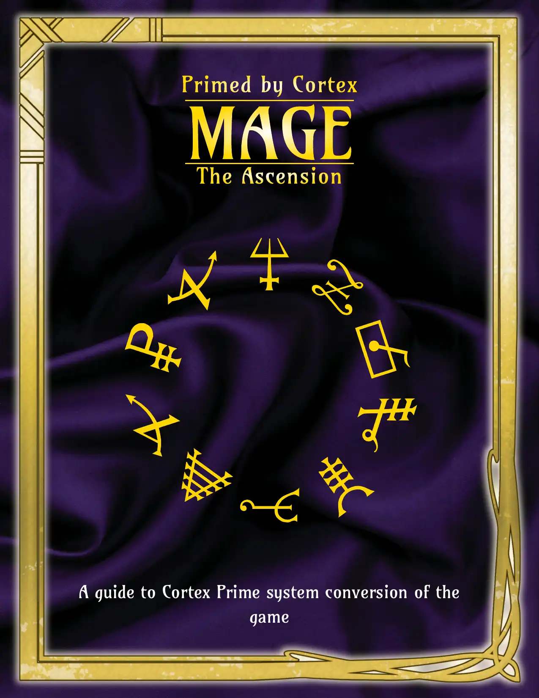

# Mage Cortex Conversion
Unofficial rules to play Mage: the Ascension using Cortex Prime

Written by Rhinemann with great thanks to Jeremy.Forbing and Miriam Robern on Cortex Prime discord for the input.

Special credit to [Vampire Cortex Prime Conversion V.1](https://docs.google.com/document/d/1cpAanelHeb_9afPwiBHyvQG0lKI4AeT4zP6Q1R8t250/edit#heading=h.hcnskrsxy7sz).

# Introduction
This is a conversion of Mage the Ascension roleplaying game, based mostly on the 20th anniversary edition of Mage.

# Rules

# Character Sheet

